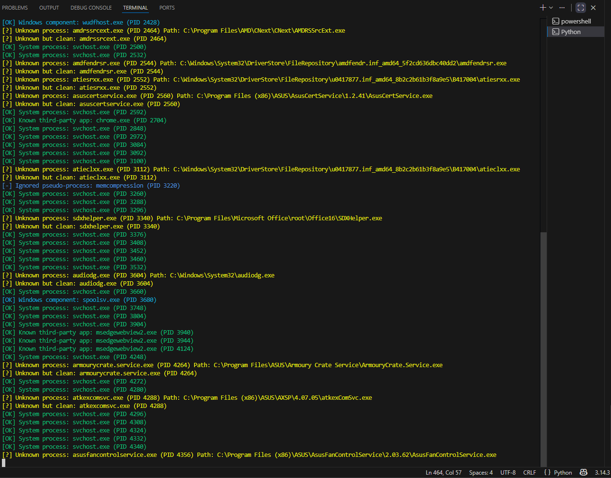
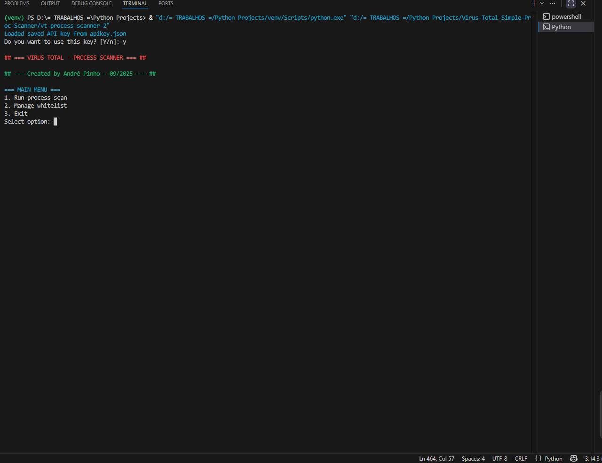
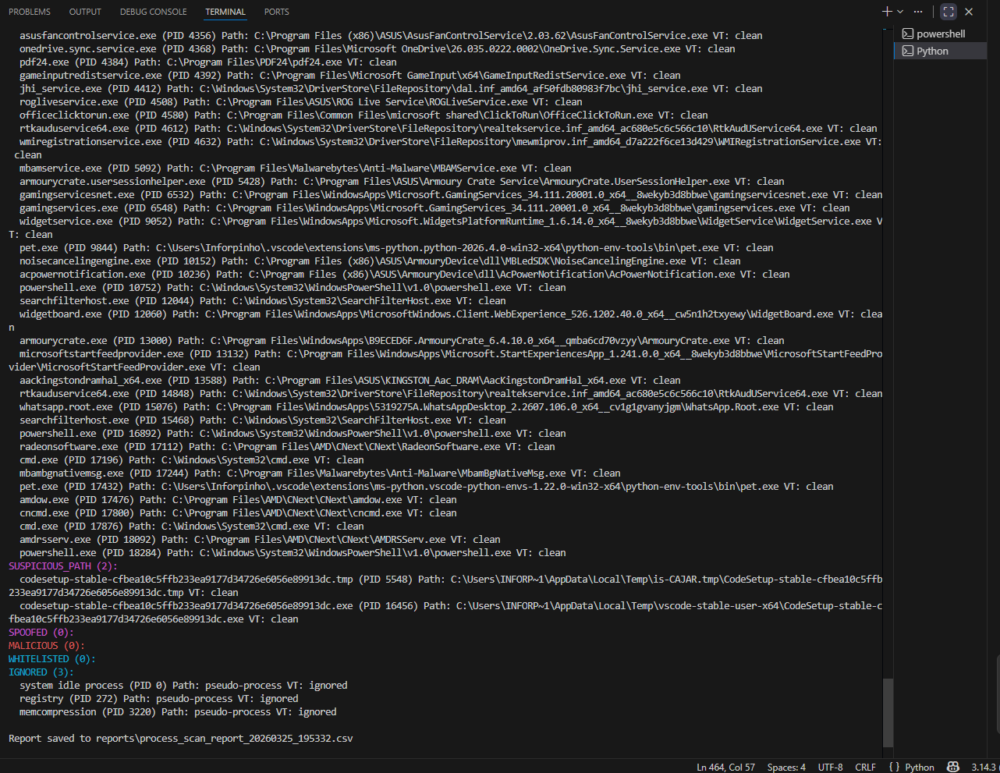
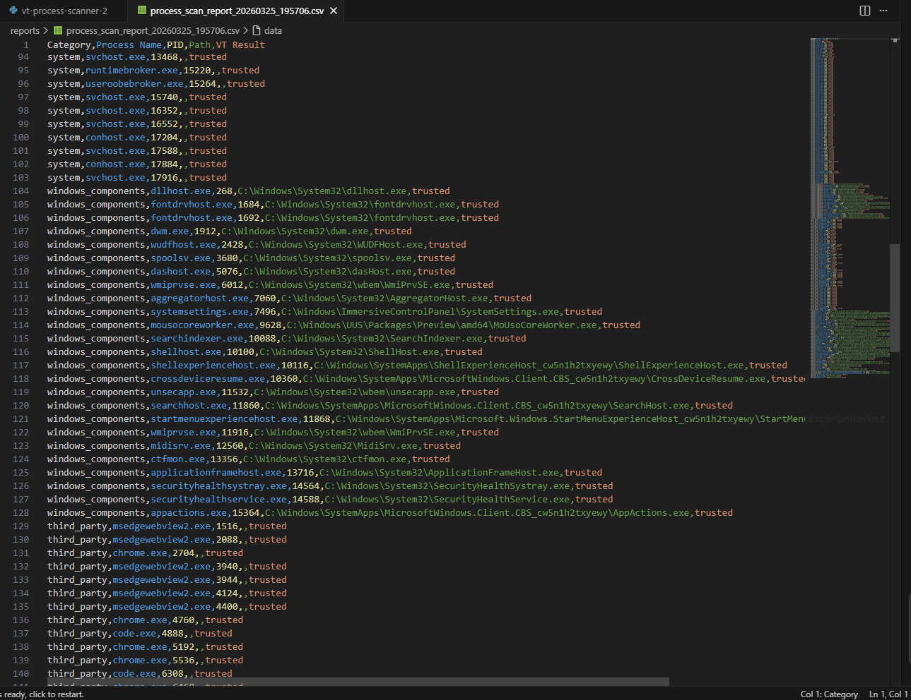
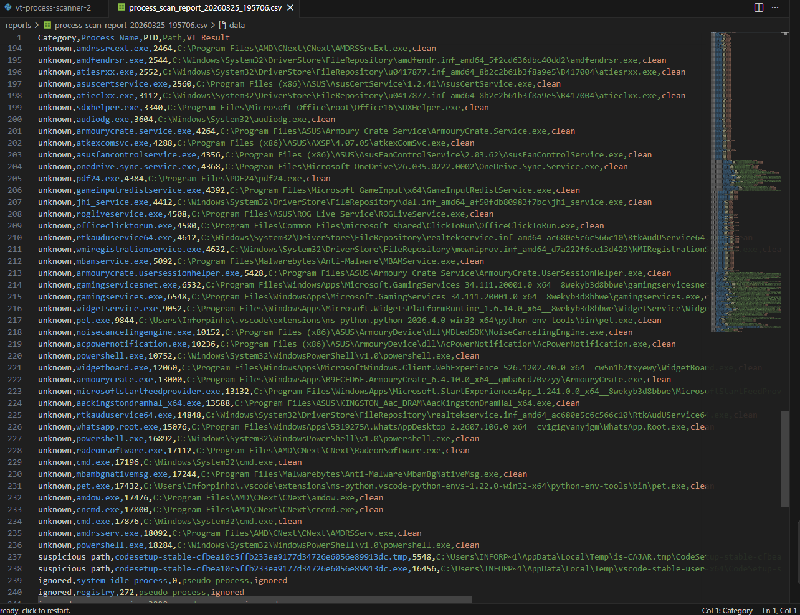

# 🛡️ VT Process Scanner

[]()
[]()
[]()



VT Process Scanner is a Windows process analysis and threat triage tool built in Python, designed to identify, classify, and assess running processes in real time.

It combines intelligent process classification, suspicious execution path detection, and VirusTotal integration to provide fast and reliable reputation-based insights for security analysis.

This tool is built for **defensive security**, **malware triage**, and **incident response workflows**, making it ideal for learning, experimentation, and real-world analysis scenarios.
---

## 🎯 Purpose

This project was built to analyze running Windows processes and support rapid identification of:

* trusted system processes
* legitimate Windows components
* known third-party applications
* executables running from suspicious or abnormal locations
* potentially malicious processes based on VirusTotal reputation analysis

---

## ✨ Features

* 🔍 Enumerates running Windows processes using `psutil`
* 🧠 Classifies processes into:

  * System
  * Windows Components
  * Known Third-Party Apps
  * Unknown
  * Suspicious Path
  * Spoofed
  * Malicious
  * Whitelisted
  * Ignored pseudo-processes

* 🚩 Detects suspicious execution from:
  * `%Temp%`
  * `%AppData%`
  * `%LocalAppData%`
  * `Downloads`

* 🔑 Integrates with VirusTotal using `vt-py`
* 📝 Supports a persistent local whitelist
* 📊 Exports timestamped CSV reports to the `reports/` folder
* 🎨 Color-coded CLI output with `colorama`

---

## 🖥️ How It Works

1. Enumerates active processes
2. Validates known Windows system process paths
3. Detects trusted Windows components
4. Detects suspicious execution paths
5. Queries VirusTotal for unknown or suspicious binaries
6. Generates a structured report in the terminal and in CSV format

---

## 📦 Installation

```bash
git clone https://github.com/andre-pinho-sec/vt-process-scanner.git
cd vt-process-scanner
```

```bash
python -m venv venv
venv\Scripts\activate
```

```bash
pip install -r requirements.txt
```

---

## 🚀 Usage

```bash
python vt-process-scanner.py
```

---

## 🔑 Configuration

On first run, insert your VirusTotal API key.
The key will be saved locally in `apikey.json`.

Create an `apikey.json` file with your VirusTotal API key:

```json
{
    "api_key": "YOUR_API_KEY_HERE"
}
```

---

## 📊 Example Categories

The scanner can classify processes into categories such as:

* **SYSTEM** → core Windows processes
* **WINDOWS_COMPONENTS** → legitimate Windows components outside the core set
* **THIRD_PARTY** → known applications such as Chrome, VS Code, and Malwarebytes
* **SUSPICIOUS_PATH** → binaries executing from temporary or user-controlled locations
* **UNKNOWN** → processes not yet recognized locally but not flagged as malicious
* **MALICIOUS** → VirusTotal detections
* **IGNORED** → pseudo-processes such as `Registry` or `MemCompression`

---

## 📁 Project Structure

```text
vt-process-scanner/
├── vt-process-scanner.py
├── requirements.txt
├── whitelist.json
├── apikey.json
├── reports/
├── screenshoots/
└── README.md
```

---

## 📄 Output

Each scan generates a CSV report containing:

* category
* process name
* PID
* path
* VirusTotal result

Reports are stored in:

```text
reports/
```

---

## ⚠️ Limitations

* This is not a full antivirus or EDR solution
* Detection quality depends partly on VirusTotal coverage
* Some legitimate vendor-specific processes may still appear as `UNKNOWN`
* Final analyst validation is still important before taking action

---

## 🧠 Lessons Learned

* Path-based validation is critical to reduce false positives
* Windows environments include many legitimate non-core processes
* Suspicious execution paths provide strong triage signals even when files appear clean
* Clear classification significantly improves analysis eficiency

---

## ⚠️ Disclaimer

This tool is intended for educational, research, and defensive security purposes only.

Always validate findings before terminating or removing processes.

---

## 👨‍💻 Author

André Pinho
Cybersecurity / Malware Analysis / Incident Response

---

## 📸 Screenshots

### Main Menu


### Process Scan


### Suspicious Detection


### CSV Report Output


### CSV Report Output 2

